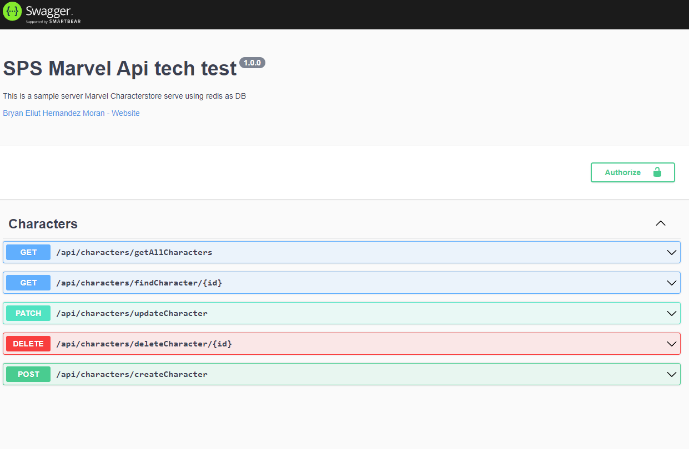
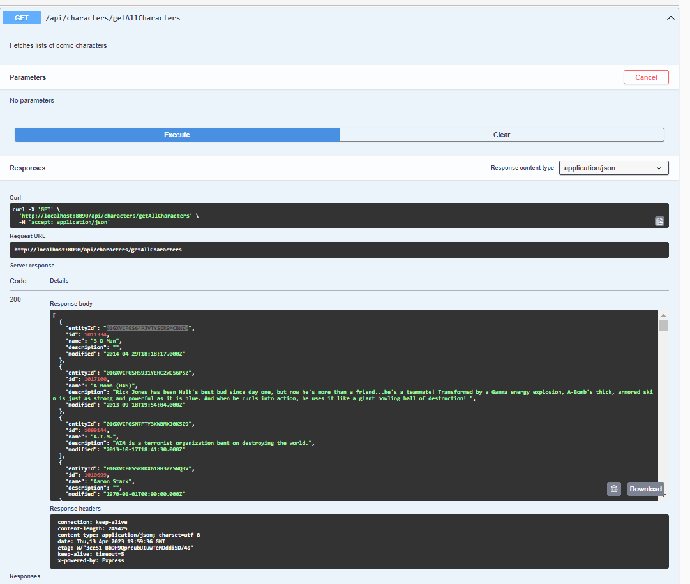
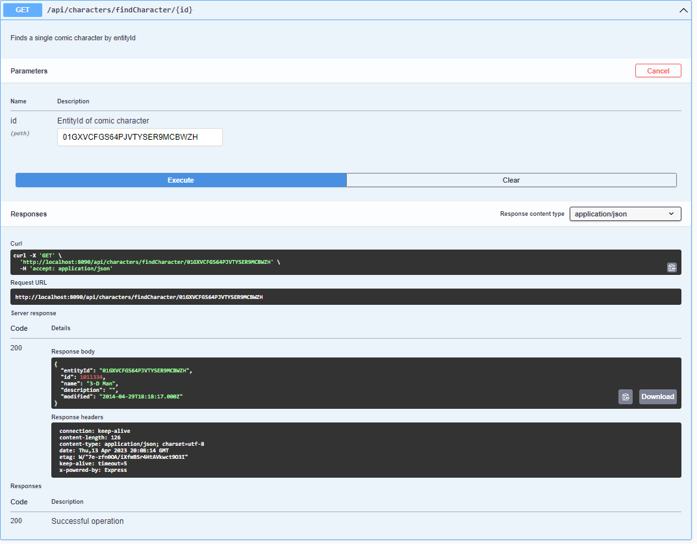
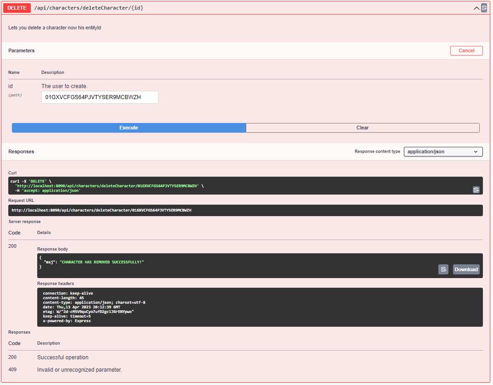
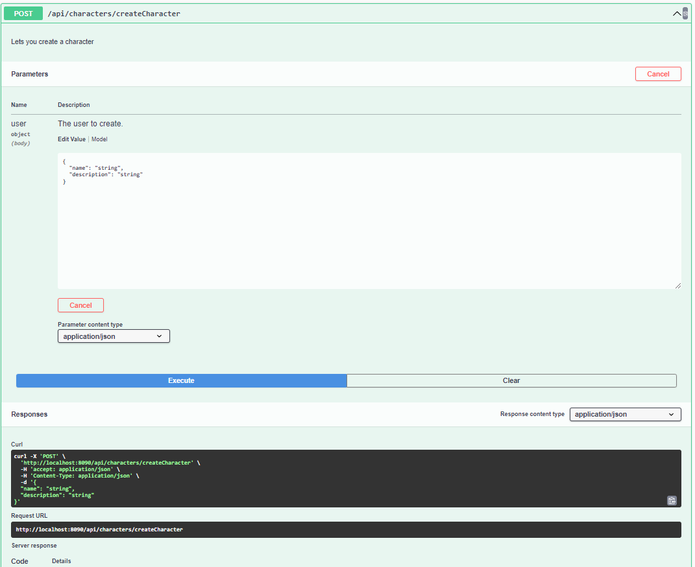
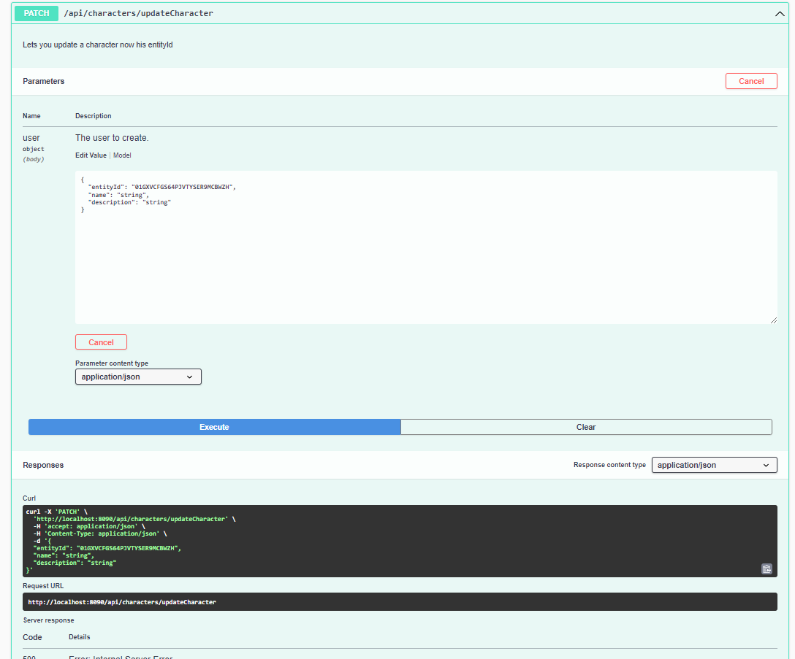

 
# SPS Marvel Api tech test
This is a sample Marvel Characterstore serve using redis as DB.  

This project was done as a technical test for SPS, in which a small rest API was build using the Marvel API, Node JS, Redis, and Docker.

## Run Locally  

Clone the project  

~~~bash  
  git clone https://github.com/bhdzit/sps-marvel.git
~~~

Go to the project directory  

~~~bash  
  cd sps-marvel
~~~

Build container 

~~~bash  
docker-compose build
~~~

Create and start containers

~~~bash  
docker-compose build
~~~
You can acces the app on 

~~~bash  
localhost:8090/api-docs/
~~~

## Environment Variables  

To run this project, you will need to add the following environment variables to your .env file,you can get these variables in <a href="https://developer.marvel.com/" target="_blank">Developer marvel</a>, for this purpose
you can find my Key on de email i send.
`PUBLIC_KEY`  

`PRIVATE_KEY` 

## Screenshots  

`getAllCharacters`

`findCharacter`

`deleteCharacter`

`createCharacter`

`updateCharacter`

## Feedback  

If you have any feedback, please reach out to us at bhdzit97@gmail.com

